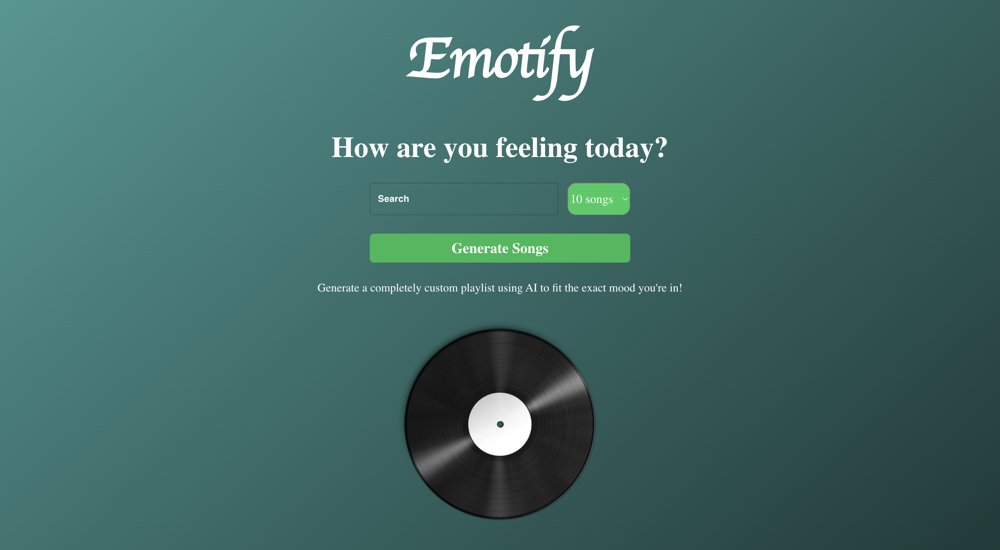

# Emotify

This project was created using ReactJS, HTML and CSS in addition to utilizing the Spotify and OpenAI APIs. 

# Summary

I developed Emotify firstly to familiarze myself with web development and get more experience utilizng React JS. Secondly, I wanted to experiment 
with the Spotify API and also play around with the potential capabillites of OpenAI and Chat GPT. Often, I find playlists on youtube on my home page
with extremely specific themes such as "music to listen to as a medieval knight." This made me wonder what AI would interpret from these kinds of prompts. 
From what AI has shown itself to be capable of in the field of art and its shocking creativity, I wondered if it could apply that same idea to music. 
Emotify users input a specific theme which OpenAI then utilizes to generate a custom Spotify playlist curated around that theme

# Screenshot

